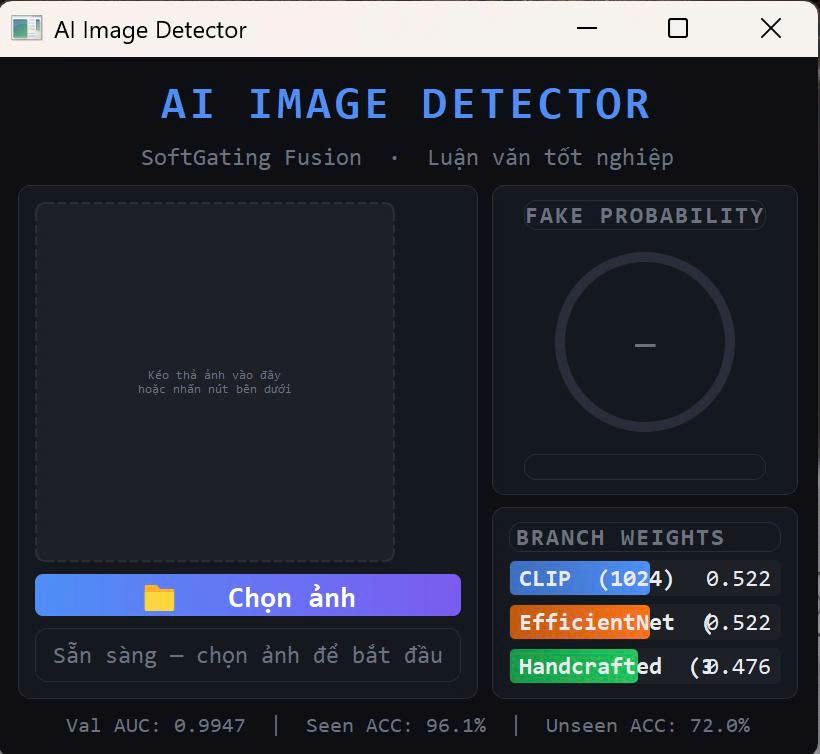
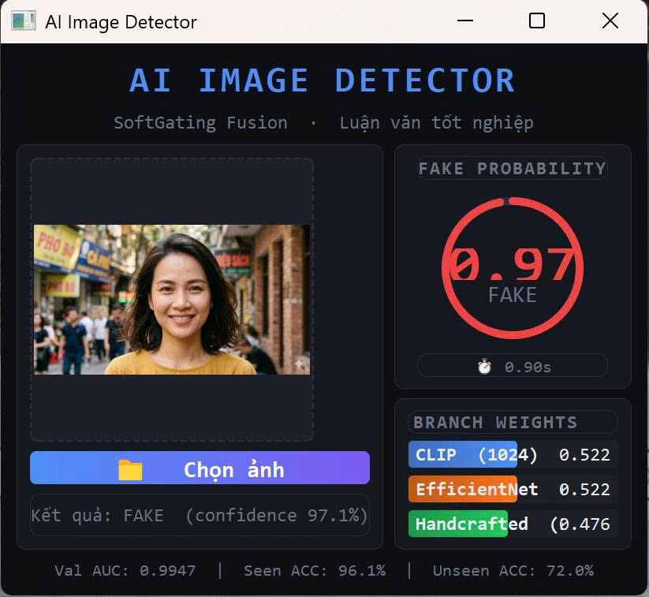

# -ai-generated-image-detection
# 🛡️ Fake Avatar Detector

> Hệ thống phát hiện ảnh đại diện giả mạo trên mạng xã hội sử dụng trí tuệ nhân tạo

[](https://python.org)
[](https://pytorch.org)
[](https://openai.com/research/clip)
[](LICENSE)

---

## 📌 Giới thiệu

Ảnh đại diện AI-generated ngày càng tinh vi và khó phân biệt bằng mắt thường, tạo ra nguy cơ giả mạo danh tính trên các nền tảng mạng xã hội. Dự án này xây dựng hệ thống phát hiện tự động với trọng tâm là **khuôn mặt người** — loại ảnh đại diện phổ biến và nguy hiểm nhất.

### Kết quả nổi bật

| Chỉ số | Giá trị |
|--------|---------|
| Face ACC (seen) | **96.00%** |
| Seen ACC | **96.12%** |
| Seen AUC | **99.47%** |
| Unseen ACC (SD3.5) | **72.00%** |
| Unseen ACC — CLIP+EffNet | **94.00%** |

---

## 🏗️ Kiến trúc

```
Ảnh đầu vào (224×224)
        │
        ├──► CLIP ViT-L/14 (frozen)     → 1024-dim
        ├──► EfficientNet-B0 (fine-tuned) → 1280-dim
        └──► SRM + DCT + LBP (thủ công)  →   38-dim
                        │
                  Soft Gating Fusion
                  g₁=0.519 · g₂=0.522 · g₃=0.477
                        │
                  MLP: 2342→256→64→1
                        │
                  Temperature Scaling (T=0.9452)
                        │
                   p̂ ∈ [0, 1]
              REAL (p̂ < 0.5) / FAKE (p̂ ≥ 0.5)
```

---

## 📊 Dataset

Bộ dữ liệu **19,073 ảnh** thiết kế theo hai tầng:

| Tầng | Nguồn | Loại | Số lượng |
|------|-------|------|----------|
| 1 — Khuôn mặt | FFHQ (ArtiFact) | Real face | 2,000 |
| 1 — Khuôn mặt | StyleGAN2-FFHQ | Fake GAN | 1,500 |
| 1 — Khuôn mặt | SD1.5 stable-face | Fake SD | 1,000 |
| 1 — Unseen | SD3.5 Medium portrait | Fake SD3.5 | 200 |
| 2 — Tổng quát | COCO (ArtiFact) | Real | 7,557 |
| 2 — Tổng quát | SD1.5 (ArtiFact) | Fake SD | 2,967 |
| 2 — Tổng quát | StyleGAN2 car/church | Fake GAN | 1,894 |
| 2 — Tổng quát | MidJourney v6 | Fake MJ | 1,955 |

---

## 🖥️ Desktop Application

Ứng dụng desktop được xây dựng bằng PyQt5, hỗ trợ phát hiện ảnh đại diện giả mạo theo thời gian thực.

<!-- Thêm ảnh chụp màn hình app ở đây -->
<p align="center">
  
  &nbsp;&nbsp;
  
</p>

### Tính năng
- 📂 Tải ảnh từ máy tính hoặc kéo thả
- 🎯 Hiển thị xác suất REAL/FAKE với gauge trực quan
- 📊 Phân tích đóng góp từng nhánh đặc trưng (gate weights)
- ⚡ Inference nhanh với ONNX Runtime

### Cài đặt

```bash
# Clone repo
git clone https://github.com/hoangchuongnguyenvu/fake-avatar-detector.git
cd fake-avatar-detector

# Cài dependencies
pip install -r requirements.txt

# Chạy app
python app.py
```

### Requirements

```
torch>=2.0
torchvision
timm
openai-clip
onnxruntime
PyQt5
Pillow
numpy
scikit-image
opencv-python
```

---

## 📁 Cấu trúc dự án

```
fake-avatar-detector/
├── app.py                          # Desktop application
├── soft_gating_fusion.onnx         # Model ONNX (production)
├── model_config.json               # Cấu hình model
├── requirements.txt
├── notebooks/
│   ├── phase1_dataset/             # Thu thập & xử lý dữ liệu
│   ├── phase2_training/            # Huấn luyện model
│   └── phase3_evaluation/          # Đánh giá & phân tích
├── figures/                        # Hình ảnh kết quả thực nghiệm
└── main.pdf                        # Luận văn đầy đủ
```

---

## 📈 Kết quả thực nghiệm

### Ablation Study

| Biến thể | Seen ACC | Face ACC | Unseen ACC |
|----------|----------|----------|------------|
| Full model (CLIP+EffNet+HC) | **0.9612** | **0.9600** | 0.3700 |
| CLIP only | 0.8833 | 0.8750 | 0.9700 |
| CLIP + EffNet | 0.9343 | 0.9300 | **0.9400** |
| CLIP + HC | 0.8968 | 0.8900 | 0.2700 |

### So sánh với baseline

| Phương pháp | Seen ACC | Face ACC | Unseen ACC |
|-------------|----------|----------|------------|
| CNNDetect | 0.8755 | 0.8200 | 0.6500 |
| UnivFD | 0.9375 | 0.9100 | 0.8900 |
| **Ours (SoftGatingFusion)** | **0.9612** | **0.9600** | 0.7200 |

---

## 🔬 Phân tích chuyên sâu

Phân tích Grad-CAM cho thấy mô hình học được **"địa chỉ artifact"** đặc thù của từng generator:
- **StyleGAN2**: artifact tập trung ở viền tóc và tai
- **SD1.5**: da mịn bất thường so với ảnh thật
- **SD3.5 (unseen)**: attention phân tán — mô hình không tìm được vùng artifact quen thuộc

Phân tích cosine distance trong CLIP space xác nhận: **khuôn mặt người là miền ngữ nghĩa nhất quán**, cho phép tổng quát hóa tốt hơn ảnh GAN tổng quát khi gặp generator mới.

---

## 👨‍💻 Tác giả

**Nguyễn Vũ Hoàng Chương**
- Trường Đại học Khoa học Huế — Khoa Công nghệ Thông tin
- Ngành: Khoa học Máy tính — Khóa 2021–2025
- GVHD: TS. Trần Thanh Lương

---

## 📄 Tài liệu

- 📖 [Luận văn đầy đủ (PDF)](main.pdf)
- 🧪 [Notebook thực nghiệm](notebooks/)

---

*Khóa luận tốt nghiệp đại học — Đại học Khoa học Huế, 2026*
